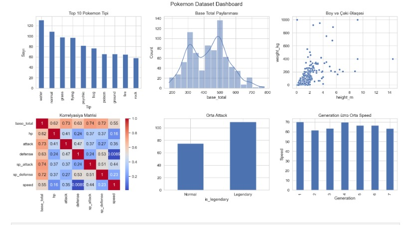
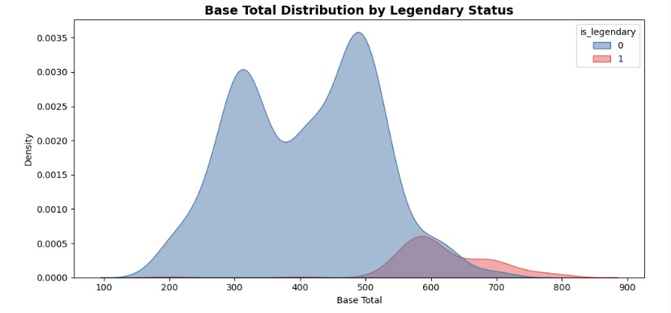
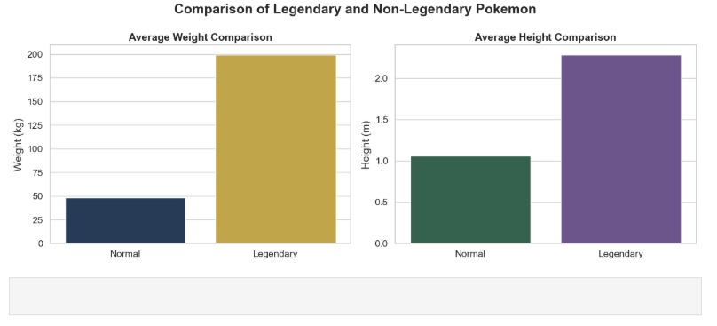
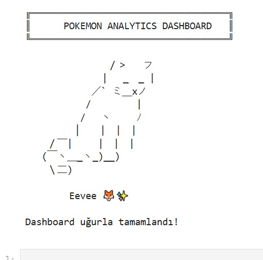

# 🐍 Pokemon Data Analysis

## 📌 Project Overview

This project explores the Pokémon dataset using Python to perform data cleaning, exploratory data analysis (EDA), and data visualization. The analysis aims to identify patterns and compare Pokémon characteristics through statistical methods and charts.

---

## 🎯 Objectives

- Clean and preprocess the dataset
- Analyze Pokémon characteristics
- Compare Legendary and Non-Legendary Pokémon
- Explore weight, height, attack, and defense statistics
- Visualize insights using charts

---

## 🛠️ Technologies Used

- Python
- Pandas
- NumPy
- Matplotlib
- Jupyter Notebook

---

## 📊 Analysis Includes

- Data Cleaning
- Descriptive Statistics
- GroupBy Analysis
- Correlation Analysis
- Data Visualization

---
## 📷 Project Visualizations

### 📊 Dashboard Overview

### ⭐ Legendary vs Non-Legendary Distribution

### 📏 Weight & Height Comparison

---

## 🎉 Project Completed

## 📂 Project Files

- `Pokemon-Data-Analysis.ipynb`
- `Pokemon.xlsx`

---

## 👩‍💻 Author

**Lamiya Guliyeva**
